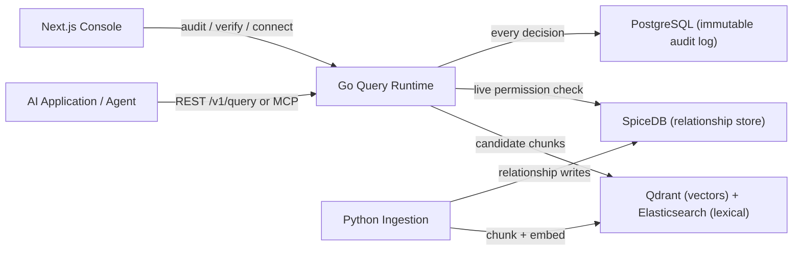

# Groundwork

**Enterprise governance layer for agentic AI.** Groundwork sits between AI applications and private data sources, enforcing live permissions, data residency, and audit requirements on every query — before any data reaches a model.


| CI | Status |
|---|---|
| Go runtime | [](https://github.com/Rehan147ig/groundwork-enterprise/actions/workflows/go-ci.yml) |
| Python ingestion | [](https://github.com/Rehan147ig/groundwork-enterprise/actions/workflows/python-ci.yml) |
| Console | [](https://github.com/Rehan147ig/groundwork-enterprise/actions/workflows/console-ci.yml) |
| Compose / infra | [](https://github.com/Rehan147ig/groundwork-enterprise/actions/workflows/compose-validate.yml) |
| Security | [](https://github.com/Rehan147ig/groundwork-enterprise/actions/workflows/security-ci.yml) |

Groundwork is **not** a RAG tool and **not** a chatbot. It is infrastructure — a runtime data access control plane.

---

## Why Groundwork

AI applications are only as safe as the data they can reach. Standard RAG stacks index everything into a vector store and let the model ask freely. Groundwork inverts that: **every retrieval is checked against live permissions at query time.**

- **Revocation is immediate.** If a user is removed from a team at 2:00 PM, they cannot retrieve documents at 2:01 PM.
- **Fail-closed by design.** If the authorization engine is unreachable, Groundwork returns *zero* chunks and records `FAIL_CLOSED` in the immutable audit log. There is no fallback to an open state.
- **Complete evidence trail.** Every decision — allowed, denied, fail-closed — is written to a tamper-evident, append-only audit log.

## What It Prevents

| Threat | Mitigation |
|---|---|
| Unauthorized data retrieval | Live SpiceDB permission checks at query time |
| Cross-tenant data leakage | Namespace/tenant isolation in the relationship store and vector indexes |
| Revoked access persisting in cache | No permission caching; every query re-checks |
| Backend failure → data exposure | Circuit breakers + fail-closed responses (0 citations) |
| Shadow-deployed AI tools | MCP server shares the exact same enforcement path as the REST API |

## Architecture



### Core components

| Component | Technology | Responsibility |
|---|---|---|
| `query-runtime` | Go 1.23 | REST gateway + MCP server, ACL evaluation, circuit breakers, audit, identity |
| `ingestion` | Python 3.11 | Semantic chunking, embeddings (FastEmbed), atomic dual-write to Qdrant + Elasticsearch |
| `console` | Next.js 16 | CISO dashboard, live ACL test screen, audit explorer |
| `spicedb` | authzed/spicedb | Live permission graph (Google Zanzibar-style ReBAC) |
| `qdrant` | Qdrant | Vector search with int8 scalar quantization |
| `elasticsearch` | Elasticsearch 8 | Lexical search (reserved for the compliance search module) |
| `postgres` | PostgreSQL | Tenant metadata, audit traces, immutable query log |

## Monorepo Structure

Turborepo-managed npm workspaces sit alongside independent Go and Python services, so a failure or rebuild in one layer never blocks another. Go and Python services build and test in isolation; the TypeScript workspaces share task orchestration, caching, and dependency graph via Turbo.

```txt
groundwork/
├── apps/
│   ├── console/              Next.js admin console (npm workspace: @groundwork/console)
│   └── marketing-site/       Static waitlist / marketing page
├── packages/
│   ├── typescript/           TypeScript API client (npm workspace: @groundwork/sdk)
│   ├── go/                   Shared Go types
│   ├── python/               Shared Python types
│   └── contracts/            Shared JSON API contracts / schemas
├── services/
│   ├── query-runtime/        Go runtime: gateway, MCP server, ACL, audit, identity
│   ├── ingestion/            Python ingestion: chunker, embedder, dual-index writer
│   └── msgraph-connector/    Go Microsoft Graph directory connector (pilot)
├── examples/
│   ├── github-demo/          GitHub org permission demo (seeder + compose)
│   └── bank-demo/            Bank folder-hierarchy demo (seeder + compose)
├── infra/                    Docker Compose profiles: dev, prod, codespace, supabase
├── deploy/                   Render, Fly, sovereign deployment packaging
├── migrations/               PostgreSQL schema migrations
├── scripts/                  Validation, demo, and integration helpers
├── docs/                     Architecture, security, governance, and ops docs
└── .github/workflows/        CI: Go, Python, console, compose, migration, security
```

## Quickstart

Prerequisites: Docker + Docker Compose, Go 1.23+, Python 3.11+, Node 18.17+.

```bash
# 1. Infrastructure (Postgres, SpiceDB, Qdrant, Elasticsearch)
docker compose -f infra/docker-compose.yml up --build -d

# 2. Go runtime — build + test
cd services/query-runtime
go build ./...
go test ./...

# 3. Python ingestion — test
cd services/ingestion
python -m unittest discover tests

# 4. Console (TypeScript workspace via Turbo)
npm install
npm run dev          # Next.js console on http://localhost:3000
```

Run an end-to-end demo:

```bash
make demo            # seed SpiceDB + indexes with the GitHub org demo
```

More: [Local development](docs/deploy-codespaces.md) · [Non-bypassable deployment](docs/non-bypassable-deployment.md) · [Demo walkthrough](docs/mcp-live-demo.md)

## Configuration

Copy `.env.example` to `.env` and set the values for your environment. Key variables:

| Variable | Purpose |
|---|---|
| `DATABASE_URL` | PostgreSQL connection for the audit log and metadata |
| `SPICEDB_ENDPOINT` | SpiceDB gRPC endpoint (e.g. `spicedb:50051`) |
| `SPICEDB_TOKEN` | SpiceDB preshared key |
| `QDRANT_URL` | Qdrant HTTP endpoint |
| `ELASTICSEARCH_URL` | Elasticsearch HTTP endpoint |
| `GROUNDWORK_API_KEY` | Bootstrap API key for the runtime |
| `GROUNDWORK_JWT_HS_SECRET` / `GROUNDWORK_OIDC_ISSUER` | Identity material (HMAC or OIDC) |

**Never commit real secrets.** `.env*` files are git-ignored.

## Security

- **Fail-closed enforcement** — timeouts, circuit trips, and backend unavailability all return zero citations and write an evidence record. See [security-ci](.github/workflows/security-ci.yml) and the [security model](docs/governance.md).
- **Immutable audit log** — append-only trace storage with SHA-256 digests and a `/v1/audit/verify` endpoint; a write is impossible to rewrite or delete. See [worm-archive](docs/worm-archive.md).
- **Live permission checks** — SpiceDB at query time; the [SpiceDB migration](docs/spicedb-migration.md) documents the full cutover from the legacy store.
- **Secrets scanning** — every PR is scanned by [secret-scan](.github/workflows/secret-scan.yml).
- **Responsible disclosure** — see [SECURITY.md](SECURITY.md).

## Testing

| Layer | Command |
|---|---|
| Go runtime (40 packages) | `cd services/query-runtime && go vet ./... && go test ./...` |
| Python ingestion | `cd services/ingestion && python -m unittest discover tests` |
| TypeScript workspaces | `npx turbo run typecheck` (or `npm run typecheck`) |
| Compose infrastructure | `docker compose -f infra/docker-compose.yml config --quiet` |

CI runs all of the above plus migration checks and secret scanning on every push.

## Documentation

- [Architecture](docs/architecture.md)
- [Governance & security](docs/governance.md)
- [Identity resolution](docs/identity-resolution.md)
- [Connectors](docs/connectors.md) · [Microsoft Graph connector](docs/microsoft-graph-connector.md)
- [Observability](docs/observability.md) · [Load testing & canary](docs/load-testing-and-canary.md)
- [Deployment](docs/non-bypassable-deployment.md) · [Codespaces](docs/deploy-codespaces.md)
- [Repository structure](docs/repository-structure.md)
- [KT / onboarding](docs/KT.md)

## Contributing

See [CONTRIBUTING.md](CONTRIBUTING.md) for the development workflow, commit conventions, and review standards.

## License

[Apache License 2.0](LICENSE) — see also the [code of conduct](CODE_OF_CONDUCT.md).

---

*Groundwork: enforce before you retrieve.*
